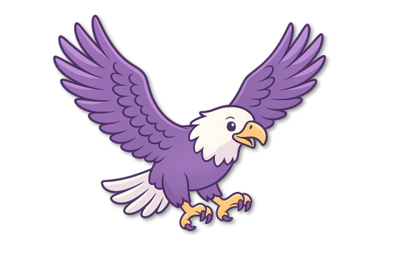

# Shared Layout Components

This document explains how to use the shared layout components for Wings of Discovery pages.

## Overview

The `shared-layout.js` file provides reusable header and footer components that are consistent across all pages. This eliminates code duplication and makes maintenance easier.

## Components

### Back Header

The back header appears at the top of application pages (plan-path.html, find-artifacts.html, team.html) with:

- "Back Home" button
- Wings of Discovery logo and branding

### Footer

The footer appears at the bottom of all pages with copyright information.

## Usage

### Current Approach (Hardcoded HTML)

Each page currently has the header and footer hardcoded in the HTML:

```html
<body>
  <div class="back-header">
    <a href="index.html" class="back-button">← Back to Home</a>
    <div class="wings-branding">
      
      The Wings of Discovery
    </div>
  </div>

  <!-- Page content -->

  <div class="footer">
    <p>
      © 2025 The Wings of Discovery. Created by
      <strong>The Quantum Crystals</strong>. All rights reserved.
    </p>
  </div>
</body>
```

### Future Approach (JavaScript Injection)

To use the shared layout JavaScript:

1. Add the script reference in your HTML file (before closing `</body>` tag):

```html
<script src="shared-layout.js"></script>
```

2. Remove the hardcoded header and footer from your HTML

3. The script will automatically inject them when the page loads

**Note:** This approach should be used consistently across all pages. Pages can opt out by including the script conditionally or not including it at all.

## Benefits

- **DRY (Don't Repeat Yourself)**: Maintain header/footer in one place
- **Consistency**: Ensures all pages have identical navigation and branding
- **Easier Updates**: Change header/footer once, affects all pages
- **Flexibility**: Can customize per page if needed

## Styling

All styles for the header and footer are in `styles.css`:

- `.back-header`: Navigation bar at top of pages
- `.back-button`: Home link button
- `.wings-branding`: Logo and branding section
- `.wings-logo`: Image styling
- `.footer`: Copyright and footer styling

## Current Status

The `shared-layout.js` file is created and ready to use. To implement across all pages:

1. Update `plan-path.html`, `find-artifacts.html`, and `team.html`
2. Remove hardcoded header and footer HTML
3. Add `<script src="shared-layout.js"></script>` before `</body>`

This will consolidate all layout components while maintaining the same visual appearance.
